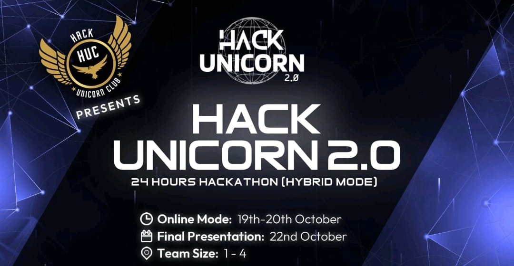
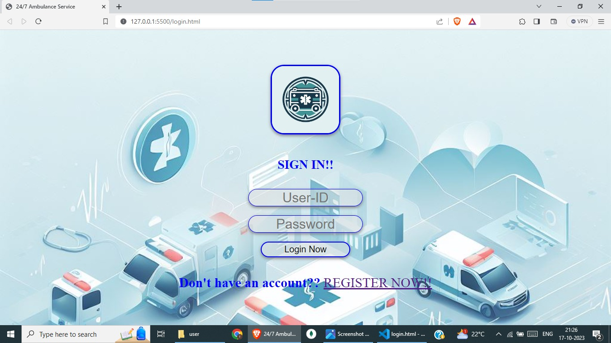
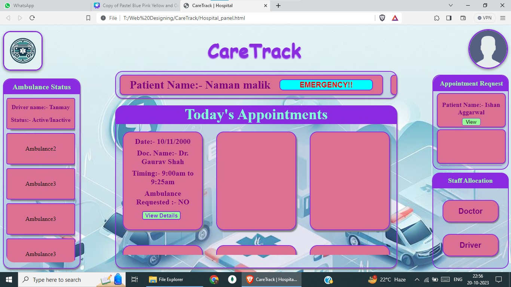
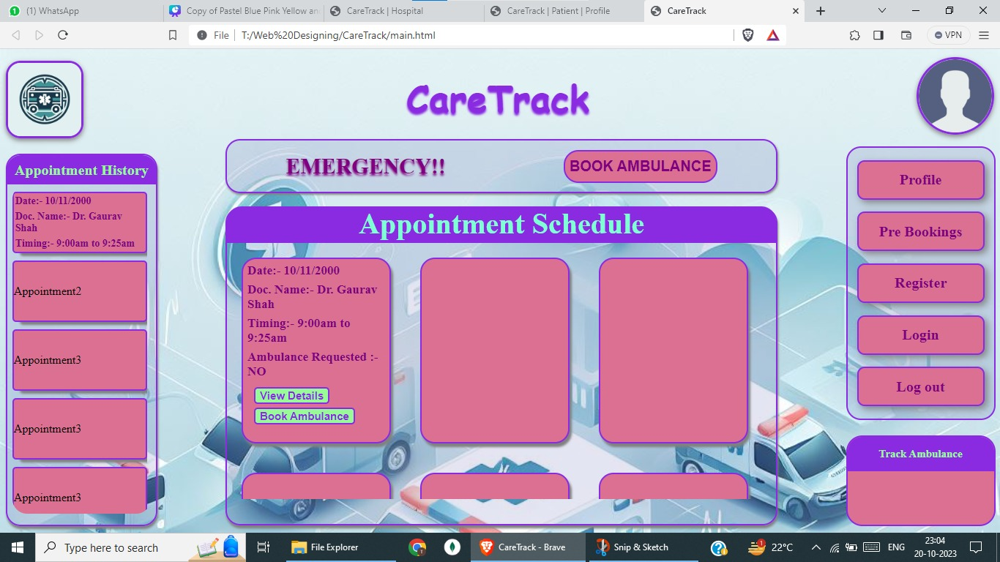
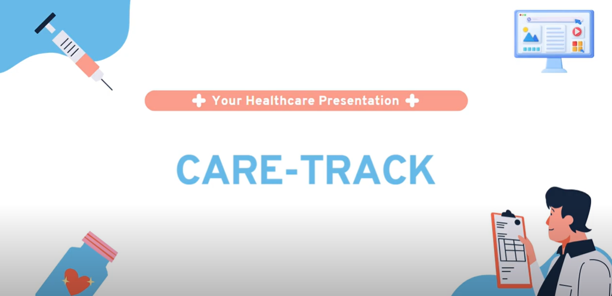

# Care Track - Hack Unicorn 2.0 Hackathon Project



Welcome to **Care Track**, our innovative solution for the [Hack Unicorn Hackathon](https://www.linkedin.com/company/hackunicornclub/). This project aims to revolutionize healthcare by enhancing healthcare efficiency by streamlining appointment scheduling, reducing administrative workload, optimizing resource allocation, and offering data-driven insights.

## Table of Contents
- [Project Overview](#project-overview)
- [Team Members](#team-members)
- [Features](#features)
- [Installation](#installation)
- [Usage](#usage)
- [Demo](#demo)
- [Technologies Used](#technologies-used)
- [Contributing](#contributing)
- [License](#license)

## Project Overview
This project was created as part of the [Hack Unicorn Hackathon](https://www.linkedin.com/company/hackunicornclub/), and it holds a special place for us as it's our very first hackathon endeavor. It was an exhilarating experience, and we are thrilled to share our journey with you.

Our project, "CareTrack," is a healthcare management solution designed to streamline hospital-patient interactions. It was born from the need for efficient, reliable, and patient-centric healthcare services. With "CareTrack," we aimed to bridge the gap between patients, hospitals, and doctors.

## Team Members
- [Naman Malik](https://www.linkedin.com/in/namanmalik18) - Team Lead, BackEnd Developer
- [Tanmay Sharma](https://www.linkedin.com/in/tanmay-sharma2903) - Frontend Developer
- [Ishan Aggarwal](https://www.linkedin.com/in/ishan-aggarwal-5444a4240) - Spokesperson
- [Roshan Kumar](https://www.linkedin.com/in/roshan-kumar-58a697274) - Team Member

## Features

- **Appointment Scheduling**: Efficiently schedule appointments with preferred doctors and hospitals for timely care.

- **Real-Time Ambulance Tracking**: Track ambulance arrivals in real time for rapid emergency response and care.

- **Health Records**: Users can securely store and access their medical records, making it easy for doctors to provide the best care.

## Installation
Follow these steps to get caretrack project up and running at your linux machine:

- **Set Up Dependencies:** You can execute the below commands
    ```bash
    sudo apt-get update
    sudo apt-get install -y mongodb-org
    sudo systemctl start mongod
    sudo apt install nodejs
    ```

- **Clone the Repository:** You can clone the project repository using the following command:

   ```bash
   git clone https://github.com/Naman065Malik/CareTrack.git
   ```

- Install Dependencies: Navigate to the project directory and install the necessary dependencies:
   ```bash
   npm install
   ```
- **Access the Application:** Open your web browser and go to http://localhost:3000 to access the application.

## Usage

- **Register Yourself:** You Can Register as Hospital or as Patient to Our Website


- **Login:** After Registration, You have to login with your credentials.
- **Note:** Hospital ID Starts with a Prefix of **HOS** 



- **Hospital Panel:** Here you can Schedule Appointment, view Ambulance Status and Allocate Staff ID



- **Patient Panel:** Here you can Book Ambulance as well as doctor appointments. And in Addition, there is an option of Emergency which can be use in an SOS Condition



## Demo
[](https://youtu.be/Vt90_56kUCE)


## Technologies Used
- Node.js
- Express.js
- MongoDB
- Json Web Token
- Mongoose
- Socket.io
- Google API


## How to Contribute

1. **Fork the Repository:** Click "Fork" to create your copy.

2. **Submit Pull Requests:** Make changes and open pull requests.

We appreciate your contributions!


<!-- ## License
[Specify the license for your project. You can use open-source licenses like MIT or Apache 2.0.] -->


## Acknowledgments

We would like to express our gratitude to the following individuals and communities for their contributions, support, and inspiration:

- Our team members, Tanmay Sharma, Ishan Aggarwal, and Roshan Chudhary, for their dedication and hard work during this hackathon.
- HackUnicorn for organizing this amazing hackathon, where we learned and had fun.
- The open-source communities whose libraries and tools made our project possible.
- The mentors and judges for their valuable feedback and guidance.

We're excited to continue building and learning together. 🚀


---


We're excited to be a part of the Hack Unicorn Hackathon and hope to make a meaningful impact with **Care Track**. Thank you for your support!

- [LinkedIn Post](https://www.linkedin.com/posts/namanmalik18_firsthackathon-healthtech-hackathon-activity-7121230536102076416-PqnW?utm_source=share&utm_medium=member_desktop)
- [Youtube Video](https://youtu.be/Vt90_56kUCE)
- [Devfolio Project](https://devfolio.co/projects/caretrack-7f55)
- [Website Link](https://caretrack.bffwarrior.tech/)
